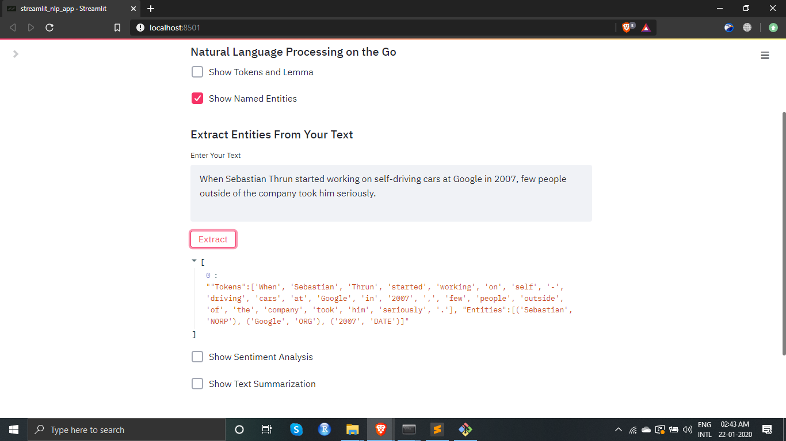

### NLP App made with ❤ by Shubhanshu using Streamlit
 - Natural Language Processing on the Go

#### Description
 - NLP app built with Streamlit Framework using SpaCy for Named Entity Recognition(NER) and tokenization, TextBlob for sentiment analysis and Gensim and Sumy for text summarization

#### To Run the App
```bash
streamlit run streamlit_nlp_app.py
```

#### Please refer requirements.txt for important packages list

#### NLP App


#### Tokenization


#### Entity Extraction with Spacy


#### Entity Extraction with Spacy


#### Sentiment Analysis with TextBlob


#### Text Summarization with Sumy/Gensim


#### Text Summarization with Sumy/Gensim

